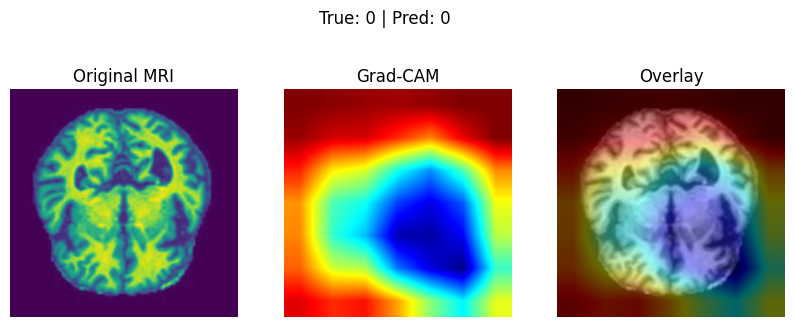
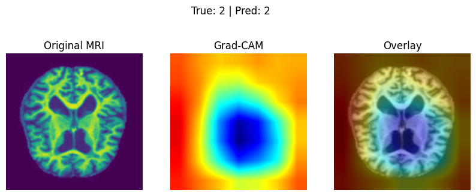
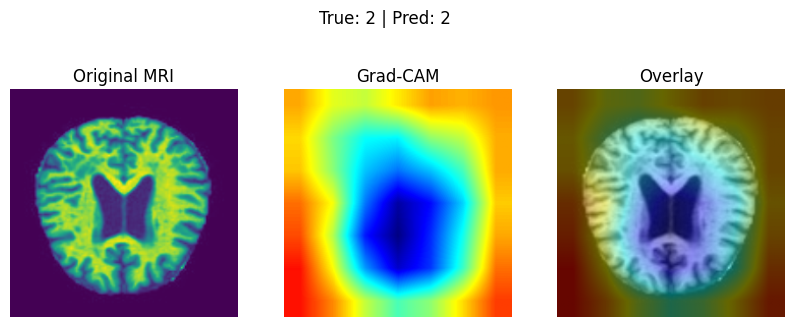
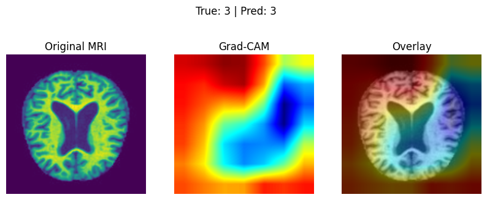
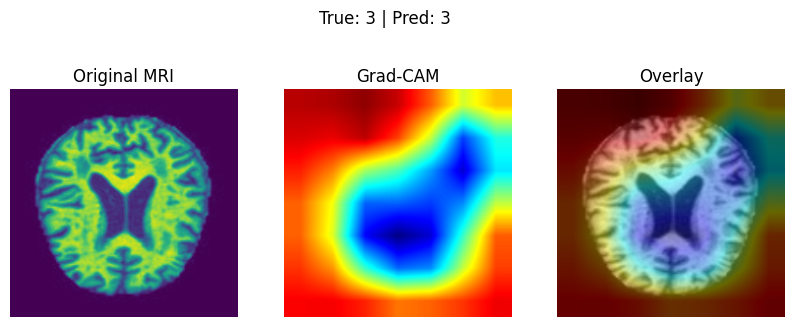

# 🧠 Explainable Alzheimer's Detection from MRI using ResNet & Grad-CAM


> **Classifying Alzheimer's disease stages from brain MRI scans using a fine-tuned ResNet-18, with Grad-CAM overlays that reveal *why* the model made each decision — making deep learning clinically transparent.**

---

## 📋 Table of Contents

- [Project Overview](#-project-overview)
- [Why Explainability Matters in Medical AI](#️-why-explainability-matters-in-medical-ai)
- [How Grad-CAM Works](#-how-grad-cam-works)
- [Architecture](#-architecture)
- [Dataset & Classes](#-dataset--classes)
- [Results](#-results)
- [Sample Outputs](#-sample-outputs)
- [Installation](#️-installation)
- [How to Run](#️-how-to-run)
- [Tech Stack](#-tech-stack)

---

## 🔬 Project Overview

Alzheimer's disease is a progressive neurological disorder that causes brain cells to degenerate and die. Early and accurate detection is critical for patient care, yet standard deep learning classifiers act as "black boxes" — producing predictions with no insight into *what* the model actually learned.

This project addresses both challenges:

1. **Accurate classification** — A ResNet-18 pretrained on ImageNet is fine-tuned on brain MRI scans to classify four stages of Alzheimer's disease, achieving **90% test accuracy**.
2. **Visual explainability** — Gradient-weighted Class Activation Mapping (Grad-CAM) generates heatmaps overlaid on each MRI scan, highlighting the specific brain regions that drove the model's prediction.

The result is a system that is not only clinically accurate, but also interpretable enough for medical professionals to trust and audit.

---

## ⚕️ Why Explainability Matters in Medical AI

In high-stakes domains like healthcare, a model that is accurate but opaque is often insufficient — and potentially dangerous.

- **Clinical trust**: Physicians need to understand *why* a model made a diagnosis before they can act on it. A heatmap that highlights atrophied hippocampal tissue aligns with established medical knowledge and builds confidence.
- **Error auditing**: When a model is wrong, explainability tools help identify whether it learned spurious patterns (e.g., imaging artifacts) rather than genuine pathology.
- **Regulatory requirements**: Medical AI systems are increasingly subject to regulations that require models to provide justifications for their decisions (e.g., EU AI Act, FDA guidance on AI/ML-based SaMD).
- **Patient safety**: Unexplainable errors in automated diagnosis can have life-altering consequences. Explainable AI (XAI) creates an additional layer of human oversight.

Grad-CAM bridges the gap between raw predictive power and actionable clinical insight.

---

## 🔍 How Grad-CAM Works

**Grad-CAM (Gradient-weighted Class Activation Mapping)** produces a coarse localization map highlighting the important regions in the input image for predicting a concept.

Here's the process in brief:

1. **Forward pass** — The input MRI image is passed through the CNN. Activations from the final convolutional layer (`layer4` in ResNet-18) are recorded.
2. **Backward pass** — Gradients of the predicted class score are computed with respect to those feature maps.
3. **Global average pooling of gradients** — The gradients are averaged spatially to produce a weight vector — one weight per feature map channel.
4. **Weighted combination** — Each feature map is multiplied by its corresponding weight and summed, then passed through a ReLU to retain only positive activations.
5. **Overlay** — The resulting heatmap is upsampled to the original image size and overlaid using a color map (JET), where **warm colors (red/yellow)** indicate regions of high influence.

```
Input MRI → ResNet-18 → [layer4 activations] → Grad-CAM → Heatmap → Overlay
```

Because `layer4` captures high-level semantic features while retaining spatial structure, the heatmaps naturally highlight anatomically meaningful regions such as the hippocampus and entorhinal cortex — areas known to degenerate in Alzheimer's disease.

---

## 🏗 Architecture

```
Input: 224×224 Grayscale MRI (converted to 3-channel)
          │
          ▼
  ResNet-18 (pretrained on ImageNet)
  ┌──────────────────────────────┐
  │  layer1  →  64 feature maps  │
  │  layer2  → 128 feature maps  │
  │  layer3  → 256 feature maps  │
  │  layer4  → 512 feature maps  │  ← Grad-CAM target
  └──────────────────────────────┘
          │
  Global Average Pooling (512-d vector)
          │
  Fully Connected (512 → 4 classes)
          │
          ▼
  Softmax → Predicted Alzheimer's Stage
```

**Key design choices:**
- **Transfer learning**: ImageNet weights provide robust low-level feature extractors (edges, textures), which are fine-tuned on the smaller MRI dataset.
- **Grayscale → 3-channel**: Single-channel MRI images are replicated across all three channels to match ResNet's expected input format.
- **Final layer replacement**: ResNet-18's default 1000-class head is replaced with a 4-class linear layer.
- **Optimizer**: Adam with cross-entropy loss; best model checkpoint saved based on validation accuracy.

---

## 📂 Dataset & Classes

The model is trained on the **Alzheimer MRI dataset** (Parquet format, sourced from Kaggle), split 80/20 into training and validation sets.

| Label | Class | Description |
|-------|-------|-------------|
| 0 | Non-Demented | No signs of cognitive decline |
| 1 | Very Mild Demented | Earliest detectable cognitive changes |
| 2 | Mild Demented | Moderate memory loss and confusion |
| 3 | Moderate Demented | Significant impairment requiring assistance |

---

## 📊 Results

**Training progression (5 epochs):**

| Epoch | Train Loss | Train Acc | Val Loss | Val Acc |
|-------|-----------|-----------|----------|---------|
| 1 | 0.9362 | 61.3% | 0.7991 | 68.3% |
| 2 | 0.6617 | 77.4% | 0.6259 | 78.2% |
| 3 | 0.4530 | 89.2% | 0.5171 | 85.4% |
| 4 | 0.3488 | 94.1% | 0.6464 | 81.4% |
| 5 | 0.3019 | 96.7% | 0.4082 | **90.0%** |

**Test Set Performance:**

| Metric | Score |
|--------|-------|
| **Test Accuracy** | **90.0%** |
| Macro F1-Score | 0.90 |
| Weighted Precision | 0.90 |
| Weighted Recall | 0.90 |

**Per-class breakdown (validation set):**

| Class | Precision | Recall | F1-Score |
|-------|-----------|--------|----------|
| Non-Demented (0) | 0.95 | 0.87 | 0.91 |
| Very Mild Demented (1) | 1.00 | 0.80 | 0.89 |
| Mild Demented (2) | 0.87 | 0.97 | 0.92 |
| Moderate Demented (3) | 0.93 | 0.81 | 0.87 |

---

## 🖼 Sample Outputs

Each Grad-CAM visualization shows three panels side-by-side:

1. **Original MRI** — The raw grayscale brain scan
2. **Grad-CAM Heatmap** — A color-coded map where warm tones (red/yellow) indicate the regions most responsible for the prediction
3. **Overlay** — The heatmap superimposed on the MRI, combining spatial context with activation intensity

**Grad-CAM examples (correctly predicted samples):**

| Non-Demented (Class 0) | Mild Demented (Class 2) | Mild Demented (Class 2) |
|:---:|:---:|:---:|
|  |  |  |

| Moderate Demented (Class 3) | Moderate Demented (Class 3) |
|:---:|:---:|
|  |  |

> **Observation**: In Mild and Moderate Demented scans, Grad-CAM consistently highlights the medial temporal lobe and ventricular regions — areas associated with atrophy in Alzheimer's pathology. Non-Demented scans show more diffuse, lower-intensity activations, reflecting healthy tissue uniformity.

---

## 🛠️ Installation

**Prerequisites:** Python 3.10+, pip

```bash
# 1. Clone the repository
git clone https://github.com/manbhavsingh/Explainable-Alzheimers-Detection.git
cd Explainable-Alzheimers-Detection

# 2. (Recommended) Create a virtual environment
python -m venv venv
source venv/bin/activate   # On Windows: venv\Scripts\activate

# 3. Install dependencies
pip install torch torchvision
pip install numpy pandas scikit-learn matplotlib seaborn
pip install opencv-python pillow jupyter
```

---

## ▶️ How to Run

The full pipeline lives in a single Jupyter Notebook:

```bash
jupyter notebook hack4health-alzheimer-mri-cnn.ipynb
```

**Notebook sections (run top-to-bottom):**

| # | Section | Description |
|---|---------|-------------|
| 1 | Imports & Setup | Install/import all libraries, set random seeds |
| 2 | Data Loading | Load MRI dataset from Parquet files |
| 3 | EDA | Visualize sample MRI scans |
| 4 | Dataset Class | Custom `AlzheimerMRIDataset` PyTorch Dataset |
| 5 | Transforms | Training augmentation + validation preprocessing |
| 6 | Train/Val Split | 80/20 stratified split |
| 7 | DataLoaders | Batch size 32, shuffled training loader |
| 8–11 | Training | Fine-tune ResNet-18, save best checkpoint |
| 12–13 | Grad-CAM | Initialize Grad-CAM on `model.layer4` |
| 14–17 | Visualization | Generate & save heatmap overlays |
| 18–25 | Evaluation | Confusion matrix, classification report, test accuracy |

**Dataset path configuration:** The notebook expects MRI data at:
```
/kaggle/input/mri-dataset/MRI Dataset/train.parquet
/kaggle/input/mri-dataset/MRI Dataset/test.parquet
```
Update these paths if running locally. The dataset is available on [Kaggle](https://www.kaggle.com/).

---

## 🧰 Tech Stack

| Category | Tool / Library |
|----------|---------------|
| Language | Python 3.10+ |
| Deep Learning | PyTorch, Torchvision |
| Model | ResNet-18 (pretrained on ImageNet) |
| Explainability | Grad-CAM (custom implementation) |
| Image Processing | OpenCV, Pillow |
| Data Handling | NumPy, Pandas |
| Evaluation | Scikit-learn |
| Visualization | Matplotlib, Seaborn |
| Environment | Jupyter Notebook, Kaggle GPU |

---

## 📄 License

This project is released under the [MIT License](LICENSE).

---

<p align="center">
  Built with ❤️ to make AI in healthcare both <strong>accurate</strong> and <strong>interpretable</strong>.
</p>
